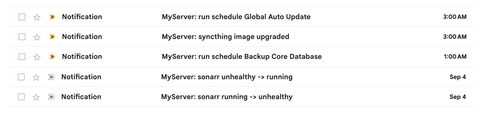

# 💌 Guten Email Notification 💌

**Zero configuration, nfty like email notification service.** Supports various apps like Jellyfin, Komodo etc 

**Perfect for:** Self-hosted apps, NAS systems, monitoring tools, CI/CD pipelines, and any service that needs reliable email notifications.

**Show your ❤️ and support by starring this project and following the author, [Guten Ye](https://github.com/gutenye)!**

## 🌠️ Screenshots

**Email notifications in action:**

*Clean, readable email notifications that work with any app or service.*

## 🌟 Features

- **Email Notiifcations**: keep your notification and history in your email inbox
- **Simple to use**: Rest api, just a title and a body.
- **Zero configuration**: Just put the url in the app, and it works out of box.
- **Write Template**: write template in javascript, no more handlerbars, go templates.
- **Support a lot of Apps**: Get notifed every thing from your NAS.
- **Human friendly messages**: easy to read message

**Why Email?** Unlike push notifications that can be lost, delayed, or blocked, email is:

- **Universal** - Works on every device and platform
- **Reliable** - Built-in retry and delivery confirmation
- **Searchable** - Find any notification in your email client
- **Persistent** - Never expires or gets lost

## 📖 Documentation

- [Send Messages](./docs/SendMessages.md)
- [Deployment](./docs/Deployment.md)
- [List of Supported Apps](./docs/SupportedApps.md)
- [Development](./docs/Development.md)

## 🙏 Acknowledgments

- [Cloudflare](https://www.cloudflare.com): Connect, protect, and build everywhere
- [Komodo](https://github.com/moghtech/komodo): a tool to build and deploy software on many servers

## 🤝 Contributing

We love contributions! Whether you’re fixing bugs, adding features, or improving documentation, your involvement makes this project better.

**How to Contribute:**

1. Fork the Repository
2. Open a Pull Request on Github

---

Thank you for using Guten Email Notification! If you found it helpful, please ⭐️ star the project ️️⭐ on GitHub. If you have any questions, encounter issues, please refer to the documentation or report an issue on GitHub.

**Special Thanks to All Contributors:**

---

  <strong><a href="#readme">⬆ Back to top ⬆</a></strong>  
  Made with ❤️ by <a href="https://github.com/gutenye">Guten Ye</a>

