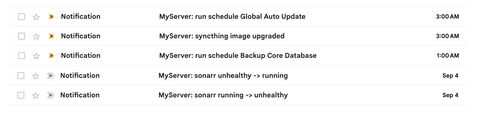

# 🧩 Guten Email Notification for Komodo 🧩

> Get instant email notifications for your [Komodo](https://github.com/moghtech/komodo) deployments and server status updates

## 🌠️ Screenshots



## 🌟 Features

- **📧 Email Notifications**: Keep your deployment history in your email inbox - never miss important updates
- **👥 Human-friendly messages**: Clean, readable notifications that anyone can understand
- **🚀 Real-time alerts**: Get notified instantly when deployments start, succeed, or fail
- **🔧 Customizable**: Skip unwanted notification types to reduce email noise

## Getting Started

1. **[Quick Deploy](../../../docs/Deployment.md)** - Deploy Guten Email Notification

2. **Configure Komodo Integration**

   Go to **Komodo Settings → Alerts** and add your notification URL:

   ```sh
   https://YOUR_DOMAIN.workers.dev/YOUR_API_KEY?_template=Komodo&_serverName=MyServer&_komodoHost=https://my-server.com
   ```

   **Configuration Parameters:**

   - \_template: Uses the Komodo email template
   - \_serverName: Your server name (appears in email subject)
   - \_komodoHost: Your Komodo instance URL

## Advanced Configuration

### Skip unwanted notification types

Via url

```sh
&skip=StackStateChange,ServiceHealthCheck,ScheduleRun.Global Auto Update
```

Via Environment

```sh
KOMODO_SKIP=..
```
